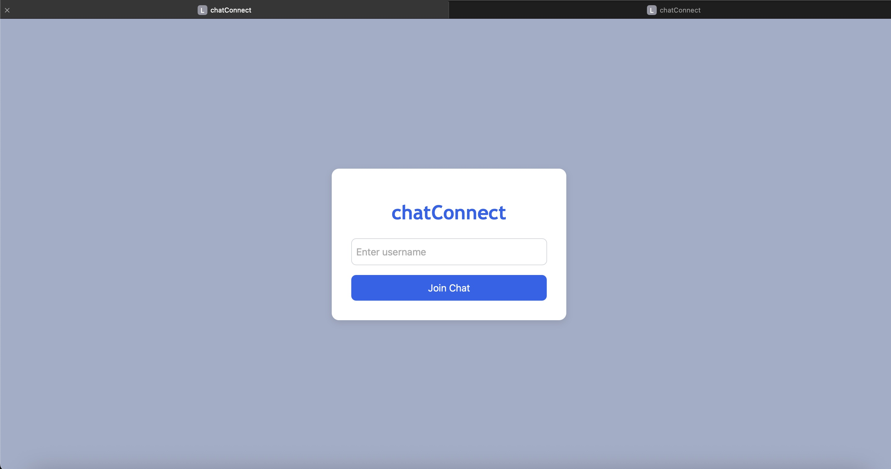
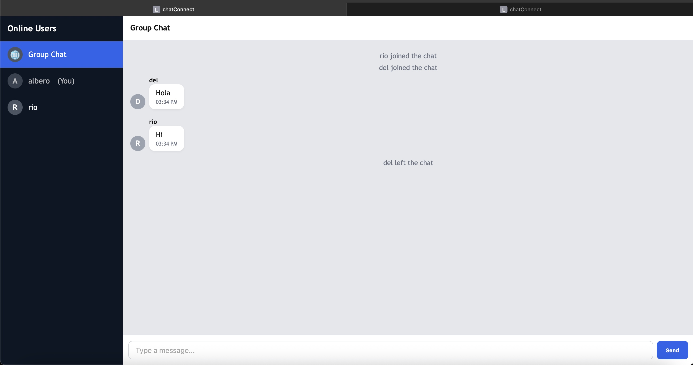

# Chat Connect

ChatConnect is a real-time chat application built with a React frontend and an Express + Socket.IO backend. It enables both group chats and private one-to-one messaging with live updates of online users, notifications when people join/leave, and message timestamps.

# Run Locally with npm

> Make sure you have [npm installed](https://nodejs.org/en/download).

### 1. Clone the repository

```bash
git clone https://github.com/paryal58/chatConnect.git chatConnect
```
```
cd chatConnect
```

### 2. Have two separate instances of terminals

# Terminal 1
```
cd backend
```
```
npm install
```
```
node server.js
```

# Terminal 2
```
cd frontend
```
```
npm run dev
```

### 3. Run the app
Visit the following link that you get following npm run dev.


### 4. Connect with other people using the app
Once you enter in the program, there is a sidebar that shows all the users online. You can freely text them privately or in a group settings as you see fit.

# Screenshot




